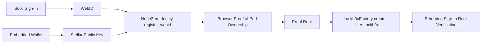

# NodeZero Social

NodeZero Social is a decentralized social app that combines Solid Pods,
Stellar Soroban contracts, and zero-knowledge proofs.

For the Stellar Hacks: Real-World ZK hackathon, the current implementation
targets Proof of Pod Ownership on Stellar TestNet:

1. Link a Solid Pod WebID to a Stellar account using `NodeZeroIdentity`.
2. Generate a browser-side Groth16/WASM proof commitment for the canonical
   WebID/Pod + Stellar account ownership claim.
3. Create or reuse a factory-provisioned user `Lockb0x` contract whose initial
   root is the validated proof root.
4. Verify returning sign-ins against the per-user lockbox root.

PoH-style human-uniqueness verification is planned for a future release and is
explicitly out of scope for this milestone.

## Hackathon Fit

This submission satisfies the core requirement: meaningful ZK integrated with
Stellar smart contracts.

1. On-chain identity link contract: `packages/contracts/src/lib.rs` (`NodeZeroIdentity`).
2. Factory-created user lockbox anchor: `packages/contracts/src/lib.rs` (`Lockb0xFactory`, `Lockb0x`).
3. Proof of Pod Ownership circuit and prover: `packages/zk-crypto/circuits/pod_ownership.circom`, `packages/zk-crypto/src/pod-ownership-prover.ts`.
4. Proof-backed provisioning path: `packages/mobile-app/src/contexts/WalletContext.tsx`, `packages/jss-provisioner/src/attestation.ts`.

## Architecture



## Repository Map

1. `packages/mobile-app`: Expo web/mobile UI and auth flows.
2. `packages/contracts`: `NodeZeroIdentity`, `Lockb0x`.
3. `packages/zk-crypto`: Circuits and artifact tooling for attestation proofs.
4. `packages/embedded-wallet`: Wallet and Soroban tx submission.
5. `scripts/stellar/deploy-testnet.sh`: TestNet deployment flow.
6. `deployments/stellar-testnet.contracts.json`: Current deployed testnet IDs.

## Quick Start (Hackathon Demo)

Prerequisites:

1. Node 20+, pnpm 11+, Stellar CLI v27.
2. Rust toolchain compatible with `packages/contracts`.
3. Circom and snarkjs available.

Install dependencies:

```bash
corepack pnpm install
```

Build circuits and trusted setup:

```bash
corepack pnpm --filter @nodezero/zk-crypto build:circuits
corepack pnpm --filter @nodezero/zk-crypto build:setup
```

Deploy contracts to Stellar TestNet:

```bash
LOCKBOX_INITIALIZATION_PROOF="demo-init" \
AUTO_FUND_SOURCE_ACCOUNT=1 \
bash scripts/stellar/deploy-testnet.sh
```

Prepare ZK artifacts and manifest:

```bash
corepack pnpm prepare:zk:testnet
```

Deploy identity and lockbox contracts to Stellar TestNet:

```bash
LOCKBOX_INITIALIZATION_PROOF="demo-init" \
AUTO_FUND_SOURCE_ACCOUNT=1 \
bash scripts/stellar/deploy-testnet.sh
```

Run the app and complete onboarding to register WebID on-chain:

1. Sign in with a Solid IdP.
2. Provision wallet.
3. Register the WebID against the wallet Stellar key.

## Demo Video Outline (2-3 minutes)

1. Problem: prove a Solid Pod is linked to the signing Stellar account.
2. Show `NodeZeroIdentity` + `Lockb0x` in repo.
3. Show onboarding path that registers WebID on-chain.
4. Show browser proof fields sent to the provisioner.
5. Show factory-created user lockbox root matching the proof root.
6. Close with practical fit: non-fungible WebID/Pod + Stellar account ownership.

## Submission Checklist

1. Public repo link: https://github.com/lockb0x-llc/nodezero-social
2. Demo video link: add link before submission.
3. Stellar network used: TestNet.
4. Live staging demo: https://staging.nodezero.social
5. ZK is load-bearing: browser-generated Proof of Pod Ownership root anchors the user lockbox.
6. Known limitations documented: yes (B1/B2/D1/D3/J3 are post-hackathon scope, all documented in `docs/staging-uat-checklist.md`).

## Future Scope

Planned, but explicitly out of scope for this milestone:

1. Proof-of-Humanity flows.
2. Nullifier-based replay-protected human uniqueness proofs.
3. Dedicated PoH verifier integration in release gates.

## Deployment References

1. Stellar TestNet + Azure release requirements:
   `docs/testnet-azure-release-requirements.md`
2. Azure Bicep templates:
   `infrastructure/azure/main.bicep`

## Current Staging TestNet Contract IDs

As of 2026-06-26, the current deployed Soroban contract IDs used for staging are:

1. Identity (`NodeZeroIdentity`):
   `CCHFYOKLGVTXEYYHWEFPI22FR26VRGG2CBBUTP6XPW3ZSIWIKEVQQ44K`
2. Lockbox (`Lockb0x`):
   `CB36LY5WZLJNMY4DHRXQER6LU3L4E5MGFYT2XSJG7ZJZV5SIIOKODT2H`

Deployment manifest source:

1. `deployments/stellar-testnet.contracts.json`

## Key Vault Secret Mapping (Staging)

These contract IDs are stored in Azure Key Vault `nodezerosocialstagingtes`:

1. `stellar-identity-contract-id`
2. `stellar-lockbox-contract-id`

Important RBAC note: this vault uses Azure RBAC authorization.
To set/update these secrets, the caller must have a role with `setSecret` permission,
for example `Key Vault Secrets Officer` (the `Key Vault Secrets User` role is read-only).
