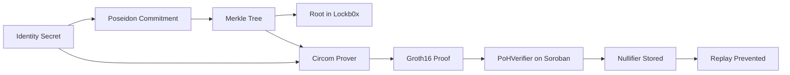

# NodeZero Social

NodeZero Social is a decentralized social app that combines Solid Pods,
Stellar Soroban contracts, and zero-knowledge proofs.

For the Stellar Hacks: Real-World ZK hackathon, this project demonstrates a
load-bearing ZK flow on Stellar TestNet:

1. Generate identity membership proofs off-chain with Circom/Groth16.
2. Verify proofs on-chain in a Soroban verifier contract.
3. Record nullifiers on-chain to prevent replay.

## Hackathon Fit

This submission satisfies the core requirement: meaningful ZK integrated with
Stellar smart contracts.

1. ZK circuits: `packages/zk-crypto/circuits/poh.circom`,
   `packages/zk-crypto/circuits/nullifier.circom`.
2. Off-chain proving: `packages/zk-crypto/src/prover.ts`.
3. On-chain verification: `packages/contracts/src/poh_verifier.rs`.
4. End-to-end demo path: `scripts/zk/demo-poh.mjs`.

## Architecture



## Repository Map

1. `packages/mobile-app`: Expo web/mobile UI and auth flows.
2. `packages/contracts`: `NodeZeroIdentity`, `Lockb0x`, `PoHVerifier`.
3. `packages/zk-crypto`: Circuits, prover, serializer.
4. `packages/embedded-wallet`: Wallet and Soroban tx submission.
5. `scripts/stellar/deploy-testnet.sh`: TestNet deployment flow.
6. `scripts/zk/demo-poh.mjs`: End-to-end PoH verification demo.

## Quick Start (Hackathon Demo)

Prerequisites:

1. Node 20+, pnpm 11+, Stellar CLI v27.
2. Rust toolchain compatible with `packages/contracts`.
3. Circom and snarkjs available.

Install dependencies:

```bash
corepack pnpm install
```

Build circuits and trusted setup:

```bash
corepack pnpm --filter @nodezero/zk-crypto build:circuits
corepack pnpm --filter @nodezero/zk-crypto build:setup
```

Deploy contracts to Stellar TestNet:

```bash
LOCKBOX_INITIALIZATION_PROOF="demo-init" \
AUTO_FUND_SOURCE_ACCOUNT=1 \
bash scripts/stellar/deploy-testnet.sh
```

Run PoH demo (dry run):

```bash
node scripts/zk/demo-poh.mjs --dry-run
```

Run PoH demo (on-chain verification):

```bash
export NZ_POH_VERIFIER_CONTRACT_ID=<deployed_contract_id>
export STELLAR_SECRET_KEY=<testnet_secret>
node scripts/zk/demo-poh.mjs
```

## Demo Video Outline (2-3 minutes)

1. Problem: prove human uniqueness without exposing identity.
2. Show `poh.circom` and `PoHVerifier` in repo.
3. Run `demo-poh.mjs` and show proof generation.
4. Show transaction submitted to Soroban TestNet.
5. Show nullifier replay protection behavior.
6. Close with real-world fit: privacy-preserving identity/compliance checks.

## Submission Checklist

1. Public repo link: this repository.
2. Demo video link: add link before submission.
3. Stellar network used: TestNet.
4. ZK is load-bearing: on-chain Groth16 verification + nullifier logic.
5. Known limitations documented: yes (work in progress accepted by hackathon rules).

## Deployment References

1. Stellar TestNet + Azure release requirements:
   `docs/testnet-azure-release-requirements.md`
2. Azure Bicep templates:
   `infrastructure/azure/main.bicep`
