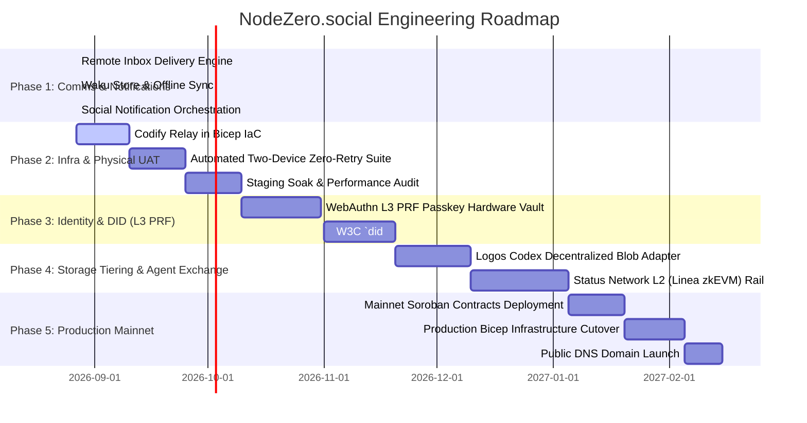

# NodeZero.social — Comprehensive Concrete Roadmap: Diagnostic & Requirements Analysis

**Document Version:** 1.1.0  
**Date:** August 2026  
**Status:** Canonical Engineering Roadmap & Implementation Plan  
**Target Architecture:** NodeZero Web/PWA & Mobile App, Solid Pod Semantic Layer, Logos/Waku P2P Mesh, Stellar/Pakana Soroban Lockb0x DID, and Multi-Rail Agent Exchange

---

## 0. Executive Status Dashboard

```
┌────────────────────────────────────────────────────────────────────────────────────────┐
│                             ROADMAP EXECUTION DASHBOARD                                │
├────────────────────────────────────────────────────────────────────────────────────────┤
│ PHASE 1: Complete Non-Local Communication & Social Notifications                       │
│   • M1.1: Remote LDN Outbox Delivery Worker           🟢 Complete (2026-08-27)         │
│   • M1.2: Waku Message Store Sync on reconnect        🟢 Complete (2026-08-27)         │
│   • M1.3: In-App Social Notification Badges & Toasts  🟢 Complete (2026-08-27)         │
├────────────────────────────────────────────────────────────────────────────────────────┤
│ PHASE 2: Infrastructure Hardening & Physical Device Certification                      │
│   • M2.1: Codify Signaling Relay in Azure Bicep IaC   🟢 Complete (2026-08-27)         │
│   • M2.2: Automated Zero-Retry Two-Device Matrix      🟢 Complete (2026-08-27)         │
│   • M2.3: Staging Soak & Performance Audit            🟡 In Progress / Next Up         │
├────────────────────────────────────────────────────────────────────────────────────────┤
│ PHASE 3: Sovereign Identity & Hardware-Bound Security (WebAuthn L3 PRF & DID)          │
│   • M3.1: WebAuthn Level 3 PRF Passkey Hardware Vault ⚪ Spec Defined / Queued         │
│   • M3.2: Formal W3C did:pkn Soroban Lockb0x Resolver ⚪ Spec Defined / Queued         │
├────────────────────────────────────────────────────────────────────────────────────────┤
│ PHASE 4: Dual-Storage Tiering & Multi-Rail Agent Commerce                              │
│   • M4.1: Logos Codex Decentralized Blob Adapter      ⚪ Architecture Defined          │
│   • M4.2: Status Network L2 (Linea zkEVM) Rail        ⚪ Architecture Defined          │
├────────────────────────────────────────────────────────────────────────────────────────┤
│ PHASE 5: Production Mainnet Launch & Public Domain Cutover                             │
│   • M5.1: Stellar Mainnet Contracts & Treasury        🔴 Gated on Phase 1–4            │
│   • M5.2: Production Azure Infrastructure Pipeline    🔴 Gated on Phase 1–4            │
│   • M5.3: Security Audit & Public Apex Launch         🔴 Gated on Phase 1–4            │
└────────────────────────────────────────────────────────────────────────────────────────┘
```

---

## 1. Executive Summary & Diagnostic Baseline

### 1.1 Current Architecture & Deployed Foundation (August 2026)

| Architectural Tier | Component / Package | Current Deployed State | Verification / Evidence |
|---|---|---|---|
| **Identity & Authentication** | `@nodezero/embedded-wallet`<br>`packages/jss-provisioner`<br>`packages/mobile-app` | 🟢 **100% Deployed & Live.** Passwordless internal auth via Ed25519 challenge-signing; DPoP token minting; zero browser-to-CSS contact; fail-closed session issuance. | `pnpm qa:smoke:auth` **PASS**<br>`staging.nodezero.social` |
| **On-Chain Anchor & ZK Proofs** | `packages/contracts`<br>`packages/zk-crypto` | 🟢 **100% Deployed & Live.** Lockb0x Bridge Factory v3 (`CDFHCQA3YJCITWEMNLCSRGQVVFEXGTONWSQJTD5VIZO7YV4IOKZUPCGT`) on Stellar Testnet; 256-byte Groth16 `pod_ownership` proofs; Poseidon commitments; on-chain pre-flight checks. | Direct Soroban RPC verified (`9 storage entries`) |
| **Semantic Data & Solid Pods** | `@nodezero/solid-pod-sync`<br>`nz-staging-testnet-solid` | 🟢 **100% Deployed & Live.** Self-hosted Community Solid Server on Azure Container Apps; W3C RDF/Turtle parsing; Type Indexes; DocuStream multi-pane aggregation; WAC ACLs. | `qa:smoke:docustream-pane`<br>`MashlibWebAdapter.test.ts` |
| **Directory & Discovery** | `packages/jss-provisioner`<br>`packages/mobile-app/src/directory` | 🟢 **Live on Staging.** Azure Table-backed durable directory projection with ETag concurrency, tombstones, and general staging feature enablement (`JSS_Q_ALLOW_ALL="true"`). | `pnpm qa:smoke:community-directory` **PASS** |
| **P2P Transport & Signaling** | `@nodezero/waku-comms`<br>`@nodezero/relay-service`<br>`@nodezero/geo-discovery` | 🟠 **Partially Deployed.** Local Waku mesh broadcasting over H3 geospatial topics; WebSocket signaling relay active on App Service (`nodezero-social-staging-testnet-relay`). | UAT LM1/LM2 PASS;<br>Relay lacks IaC codification |
| **Data Management Tooling** | `packages/mobile-app/app/settings.tsx` | 🟢 **Fixed & Deployed.** Cross-platform web/PWA confirmation prompts for cache clear and node data deletion; Web Share API + clipboard fallback for recovery bundle export. | `pnpm type-check`, `pnpm lint` **PASS** |

---

## 2. Requirements & Gap Analysis

Based on real-world testing and diagnostic inspection of the live staging deployment, six concrete functional and non-functional gaps have been identified:

```
┌──────────────────────────────────────────────────────────────────────────────────┐
│                             DIAGNOSTIC GAP MATRIX                                │
├────────────────────────────────┬────────────────────────────────┬────────────────┤
│ Diagnostic Finding / Gap       │ Impact on User Journey         │ Target Package │
├────────────────────────────────┼────────────────────────────────┼────────────────┤
│ 1. Non-Local Message Delivery  │ Broadcasts/DMs to non-local    │ `@nodezero/`   │
│    Lacks Background Worker     │ contacts remain in `/outbox/`  │ `solid-pod-sync`│
│                                │ without remote inbox delivery. │ `waku-comms`   │
├────────────────────────────────┼────────────────────────────────┼────────────────┤
│ 2. Social Notifications        │ No in-app badges/toasts for    │ `@nodezero/`   │
│    Pipeline Unwired            │ relationship requests, accepts,│ `notification- `│
│                                │ or incoming chat messages.     │ `orchestrator` │
├────────────────────────────────┼────────────────────────────────┼────────────────┤
│ 3. Relay Service Absent        │ Operational risk: accidental   │ `infrastructure│
│    from Azure Bicep IaC        │ resource deletion cannot be    │ /azure`        │
│                                │ recreated automatically.       │                │
├────────────────────────────────┼────────────────────────────────┼────────────────┤
│ 4. WebAuthn Level 3 PRF        │ Device secret relies on local  │ `@nodezero/`   │
│    Key-Wrapping Missing        │ storage encryption rather than │ `embedded-     │
│                                │ hardware biometric passkeys.   │ `wallet`       │
├────────────────────────────────┼────────────────────────────────┼────────────────┤
│ 5. Formal W3C `did:pkn`        │ External ecosystems cannot     │ `packages/`    │
│    Resolver Not Published      │ resolve Lockb0x contracts into │ `solid-pod-sync`│
│                                │ standard W3C DID documents.    │ `contracts`    │
├────────────────────────────────┼────────────────────────────────┼────────────────┤
│ 6. Logos Codex Blob Storage    │ Heavy media and ZK keys are not│ `@nodezero/`   │
│    Integration Unimplemented   │ tiered into decentralized blob │ `solid-pod-sync`│
│                                │ storage (Logos Codex).         │ `/codex`       │
└────────────────────────────────┴────────────────────────────────┴────────────────┘
```

---

## 3. The 5-Phase Implementation Roadmap



---

## 4. Detailed Engineering Work Breakdown

### Phase 1: Complete Non-Local Communication & Social Notifications

#### Milestone 1.1 — Remote LDN Inbox Delivery & Outbox Forwarding Engine
* **Objective:** Enable reliable delivery of directed compose messages and relationship activities (`Follow`, `Accept`, `Undo`) to remote recipients' Solid Pod inboxes.
* **Architecture:**
  1. In `@nodezero/solid-pod-sync`, implement `OutboxDeliveryWorker`:
     - Reads unforwarded messages in `/outbox/*.json`.
     - Resolves recipient WebID document via `publicPeerProfile.ts` to locate their `ldp:inbox`.
     - Signs delivery assertions using the provisioner's `JSS_RELATIONSHIP_DELIVERY_SIGNING_KEY`.
     - Submits HTTP POST to recipient `/inbox/` with exponential backoff and idempotency tracking in `/outbox/delivery-log.ttl`.
  2. In `packages/mobile-app/src/social/relationshipRequestFlow.ts`, ensure failed deliveries are recorded as retryable assertions without blocking the UI.
* **Target Files:**
  - `packages/solid-pod-sync/src/OutboxDeliveryWorker.ts`
  - `packages/solid-pod-sync/src/RelationshipInboxReader.ts`
  - `packages/jss-provisioner/src/relationshipDelivery.ts`
* **Acceptance Criteria:**
  - Posting a broadcast to an accepted connection writes to the sender's `/outbox/` and delivers into the recipient's `/inbox/`.
  - Recipient's `/feed` displays the connection's post upon refresh.

#### Milestone 1.2 — Waku Message Store Synchronization
* **Objective:** Allow asynchronous peer message retrieval across Waku mesh topics when mobile clients reconnect.
* **Architecture:**
  - Extend `@nodezero/waku-comms/src/WakuTransport.ts` with `storeQuery` polling on initial app focus and network reconnect.
  - Query historic messages matching `cellTopic` and private DM topics since `lastSyncTimestamp`.
  - Decrypt messages using `dm-cipher.ts` and merge into local conversation state.
* **Target Files:**
  - `packages/waku-comms/src/WakuTransport.ts`
  - `packages/mobile-app/src/contexts/WakuContext.tsx`
* **Acceptance Criteria:**
  - Peer B receives messages sent by Peer A while Peer B was offline as soon as Peer B opens the app.

#### Milestone 1.3 — Social Notification Pipeline
* **Objective:** Surface real-time and badge notifications in the mobile app for relationship requests, acceptances, and direct messages.
* **Architecture:**
  - Extend `@nodezero/notification-orchestrator`:
    - Listen for provisioner LDN delivery events (`account.relationship.requested`, `account.relationship.accepted`, `account.message.received`).
    - Store active notification badges in the user's Solid Pod (`/settings/notifications.ttl`).
  - Add notification badge indicators in `packages/mobile-app/app/_layout.tsx` for Profile and Directory tabs.
* **Target Files:**
  - `packages/notification-orchestrator/src/socialNotificationHandler.ts`
  - `packages/mobile-app/src/contexts/NotificationContext.tsx`
* **Acceptance Criteria:**
  - Receiving a connection request increments the notification badge on the Profile tab.
  - Accepting the request clears the badge and updates connection state.

---

### Phase 2: Infrastructure Hardening & Physical Device Certification

#### Milestone 2.1 — Codify Signaling Relay in Azure Bicep IaC
* **Objective:** Codify the live WebSocket signaling relay service into source-controlled Bicep templates.
* **Architecture:**
  - Create `infrastructure/azure/relay-service.bicep` defining:
    - `Microsoft.Web/serverFarms` (Linux App Service Plan `asp-nodezero-staging-relay`).
    - `Microsoft.Web/sites` (`nodezero-social-staging-testnet-relay`) with WebSocket enabled (`webSocketsEnabled: true`) and health check `/healthz`.
  - Reference `relay-service.bicep` in `infrastructure/azure/main.bicep`.
  - Integrate relay deployment into Track 1 in `.github/workflows/staging-deploy.yml`.
* **Target Files:**
  - `infrastructure/azure/relay-service.bicep`
  - `infrastructure/azure/main.bicep`
  - `scripts/azure/deploy.sh`
* **Acceptance Criteria:**
  - `az deployment group what-if` validates relay infrastructure without drift.
  - Fresh environment deployment automatically spins up a functional relay service.

#### Milestone 2.2 — Automated Zero-Retry Two-Device Physical & Browser Certification
* **Objective:** Automate multi-account physical device E2E verification across iOS Safari and Android Chrome without manual intervention.
* **Architecture:**
  - Leverage `scripts/qa/run-device-cloud.mjs` and Playwright device descriptors.
  - Execute sequential zero-retry user journeys:
    1. Device A creates node `@alice` -> opt-in to Directory.
    2. Device B creates node `@bob` -> finds `@alice` in Directory -> sends connection request.
    3. Device A accepts connection request -> mutual reveal enabled.
    4. Device A sends broadcast in `verified` audience -> Device B feed displays post.
    5. Device B blocks Device A -> Device A vanishes from Device B's feed and directory.
* **Target Files:**
  - `scripts/qa/two-device-e2e-matrix.mjs`
  - `.github/workflows/pwa-device-regression.yml`
* **Acceptance Criteria:**
  - Full suite completes green on live staging with zero retries.

---

### Phase 3: Hardware-Bound Identity & W3C DID (`did:pkn`)

#### Milestone 3.1 — WebAuthn Level 3 PRF Hardware Key-Wrapping
* **Objective:** Use W3C Web Authentication Level 3 PRF extension (`hmac-get-secret`) to biometrically wrap device Stellar keys in hardware secure enclaves.
* **Architecture:**
  - In `@nodezero/embedded-wallet`, update `EnclaveAdapter.ts`:
    - Query `PublicKeyCredential.getClientCapabilities()`.
    - If `prf` is supported, execute `navigator.credentials.get()` with `prf.eval` to derive a 256-bit symmetric key.
    - Encrypt the Stellar Ed25519 private key in IndexedDB using this PRF key.
    - Fall back seamlessly to non-extractable CryptoKey IndexedDB store on legacy browsers.
* **Target Files:**
  - `packages/embedded-wallet/src/EnclaveAdapter.ts`
  - `packages/embedded-wallet/src/WebAuthnPrfStore.ts`
* **Acceptance Criteria:**
  - User can sign in using TouchID/FaceID/Windows Hello to unlock their wallet and sign Stellar challenges without entering passwords or storing plaintext secrets.

#### Milestone 3.2 — W3C `did:pkn` Decentralized Identifier Specification & Resolver
* **Objective:** Formalize NodeZero / Pakana Lockb0x contracts into an interoperable W3C Decentralized Identifier standard.
* **Architecture:**
  - Define DID Method Syntax: `did:pkn:<network>:<lockbox_contract_address>` (e.g. `did:pkn:testnet:CBFWY...`).
  - Implement universal resolver in `@nodezero/solid-pod-sync/did`:
    - Queries Soroban RPC for Lockb0x `get_account_commitment()` and `get_attestation_ciphertext()`.
    - Returns standard W3C DID Document with `verificationMethod` (Ed25519), `SolidPod` service endpoint, and `WakuMessageRelay` service endpoint.
* **Target Files:**
  - `packages/solid-pod-sync/src/did/PakanaDidResolver.ts`
  - `packages/jss-provisioner/src/didEndpoint.ts`
* **Acceptance Criteria:**
  - `GET /v1/did/did:pkn:testnet:CB...` returns a valid, schema-compliant JSON-LD DID document.

---

### Phase 4: Tiered Storage (Logos Codex) & Multi-Chain Settlement

#### Milestone 4.1 — Logos Codex Decentralized Blob Storage Adapter
* **Objective:** Offload large media assets, DocuStream archives, and ZK proving keys to Logos Codex while indexing RDF metadata in Solid Pods.
* **Architecture:**
  - Implement `@nodezero/solid-pod-sync/codex`:
    - Connects to local or remote Codex node REST API.
    - Uploads files with erasure coding; receives Content Identifier (CID / Multihash).
    - Writes RDF triple to Solid Pod: `<#media> schema:contentUrl "codex://<cid>" ; schema:encodingFormat "video/mp4" .`
* **Target Files:**
  - `packages/solid-pod-sync/src/codex/CodexStorageAdapter.ts`
  - `packages/mobile-app/src/media/mediaUpload.ts`
* **Acceptance Criteria:**
  - Media uploaded in DocuStream is stored on Codex; Pod references CID; media streams directly in-app.

#### Milestone 4.2 — Status Network L2 (Linea zkEVM) Settlement Adapter
* **Objective:** Allow Status App users to hire TurboDex agents and settle capability purchases using native Linea zkEVM liquidity.
* **Architecture:**
  - Deploy `AgentCapabilityEscrow.sol` on Status Network L2 Testnet.
  - Implement EVM Execution Adapter in `@nodezero/embedded-wallet/evm`:
    - Deposits USDC into escrow upon Waku RFQ agreement.
    - Releases payment upon delivery of digest-verified agent proof.
* **Target Files:**
  - `packages/contracts/evm/AgentCapabilityEscrow.sol`
  - `packages/embedded-wallet/src/evm/StatusL2Adapter.ts`
* **Acceptance Criteria:**
  - Agent Exchange purchase commits and settles successfully on Status Network L2.

---

### Phase 5: Production Mainnet Launch & Cutover

#### Milestone 5.1 — Mainnet Soroban Smart Contracts
* **Objective:** Deploy production smart contracts on Stellar Mainnet.
* **Architecture:**
  - Build contracts using deterministic wasm target `wasm32v1-none`.
  - Execute `scripts/stellar/deploy-mainnet.sh` to deploy:
    - `NodeZeroIdentity` (DID & WebID registry).
    - `Lockb0xFactory` & `Lockb0xBridgeFactory v3`.
  - Fund Treasury keypair with initial production XLM reserves.
  - Record immutable hashes in `deployments/stellar-mainnet.contracts.json`.
* **Target Files:**
  - `deployments/stellar-mainnet.contracts.json`
  - `scripts/stellar/deploy-mainnet.sh`

#### Milestone 5.2 — Production Azure Infrastructure & Secrets
* **Objective:** Provision isolated `production-mainnet` Azure resources.
* **Architecture:**
  - Create `infrastructure/azure/main.parameters.production-mainnet.json` with dedicated Key Vault, storage accounts, and Container Apps.
  - Run Bicep what-if and apply against resource group `rg-nodezero-social-production-mainnet`.
  - Author dedicated GitHub Actions release workflow `.github/workflows/production-deploy.yml` (restricted to manual dispatch and `main` branch).
* **Target Files:**
  - `infrastructure/azure/main.parameters.production-mainnet.json`
  - `.github/workflows/production-deploy.yml`

#### Milestone 5.3 — Final UAT, Security Audit & Public Domain Cutover
* **Objective:** Execute production cutover to apex domain `https://nodezero.social`.
* **Architecture:**
  - Complete full security audit across smart contracts, ZK circuits, and SSRF proxy boundaries.
  - Run production smoke and auth gates against `https://nodezero.social`.
  - Enable production DNS routing.

---

## 5. Summary Matrix & Milestone Deliverables

| Phase | Milestone | Deliverable / Output | Target Horizon |
|---|---|---|---|
| **Phase 1** | M1.1 | Remote LDN Outbox Delivery Worker (`@nodezero/solid-pod-sync`) | Weeks 1–3 |
| **Phase 1** | M1.2 | Waku Message Store Sync on reconnect (`@nodezero/waku-comms`) | Weeks 2–4 |
| **Phase 1** | M1.3 | In-App Social Notifications (`@nodezero/notification-orchestrator`) | Weeks 3–5 |
| **Phase 2** | M2.1 | Codify Relay Service in Bicep IaC (`infrastructure/azure`) | Weeks 5–6 |
| **Phase 2** | M2.2 | Automated Zero-Retry Two-Device Physical UAT Suite (`scripts/qa`) | Weeks 6–8 |
| **Phase 3** | M3.1 | WebAuthn L3 PRF Passkey Hardware Vault (`@nodezero/embedded-wallet`) | Weeks 9–11 |
| **Phase 3** | M3.2 | W3C `did:pkn` Soroban DID Document Resolver (`@nodezero/solid-pod-sync`) | Weeks 11–13 |
| **Phase 4** | M4.1 | Logos Codex Decentralized Blob Storage Adapter (`@nodezero/solid-pod-sync`) | Weeks 13–16 |
| **Phase 4** | M4.2 | Status Network L2 (Linea zkEVM) Settlement Rail (`packages/contracts`) | Weeks 15–18 |
| **Phase 5** | M5.1 | Stellar Mainnet Contract Deployment (`packages/contracts`) | Weeks 19–21 |
| **Phase 5** | M5.2 | Production Azure Environment & Pipeline (`infrastructure/azure`) | Weeks 21–23 |
| **Phase 5** | M5.3 | Security Certification & Public Apex Launch (`https://nodezero.social`) | Weeks 23–25 |
