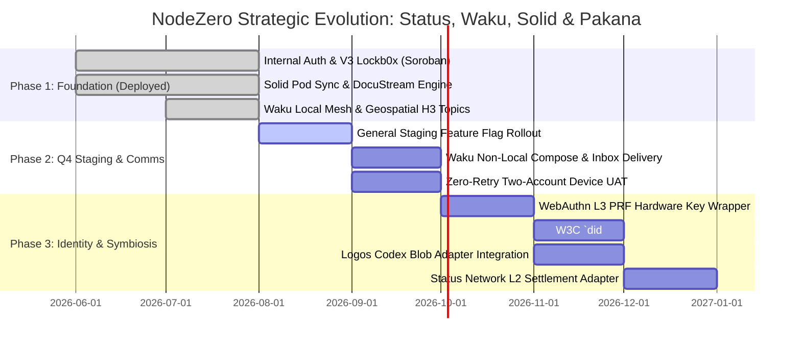

# Strategic Architecture: NodeZero.social, Status Ecosystem, Logos/Waku, Solid Pods, and Pakana Lockb0x DID

> ⚠️ **Corrections applied 2026-09-01.** This document describes **strategic intent**, not
> delivered capability. An independent audit found that several subsystems referenced here
> are written but not wired:
>
> - **`did:pkn`** — the deployed resolver has **no Soroban binding** and returns a
>   hard-coded public key for every DID. See
>   [`standards/known-non-conformance.md` NC-01](standards/known-non-conformance.md).
> - **WebAuthn L3 PRF** — primitive only; no passkey ceremony, zero consumers (NC-03).
> - **Logos Codex and Status L2 adapters** — stubs with zero consumers (NC-08).
> - **ZK verification is off-chain and provisioner-trusted**, not on-chain (NC-04).
> - The ZK circuit is **`pod_stellar_bridge_v3`**, not `pod_ownership`.
>
> For verified current status see [`executive-summary.md`](executive-summary.md).
> For sequenced work see [`roadmap.md`](roadmap.md).
> For the formal DID method specification see [`standards/did-pkn-method.md`](standards/did-pkn-method.md).

**Status:** Strategic blueprint — **aspirational, not a status report**  
**Date:** August 2026  
**Scope:** `@nodezero-social` Monorepo, TurboDex Agent Exchange, Status App Symbiosis, and Pakana Financial/DID Plane

---

## 1. Executive Context & Ecosystem Landscape

NodeZero.social is a decentralized social platform and sovereign agent orchestration environment. Recent external architectural reviews highlighted overlaps and integration opportunities between NodeZero, the **Status ecosystem** (Status App, Logos, Waku, Codex, Status Network L2), **Solid Pods**, and the **Stellar/Pakana lockb0x** infrastructure.

This document grounds those third-party insights in the actual source code, cryptographic invariants, and deployed cloud/blockchain infrastructure of the NodeZero platform.

```
┌──────────────────────────────────────────────────────────────────────────────────┐
│                             CONSUMER EXPERIENCE LAYER                            │
│   ┌────────────────────────────────────────┐  ┌──────────────────────────────┐   │
│   │   Status App (Mobile Super App)        │  │   NodeZero.social (PWA/Web)  │   │
│   │   • Private messenger & wallet vault   │  │   • Social graph & DocuStream│   │
│   │   • Ethereum/Linea L2 transactions     │  │   • Agent Exchange / Studio  │   │
│   └───────────────────┬────────────────────┘  └──────────────┬───────────────┘   │
└───────────────────────┼──────────────────────────────────────┼───────────────────┘
                        │                                      │
┌───────────────────────┼──────────────────────────────────────┼───────────────────┐
│                       ▼                                      ▼                   │
│                       TRANSPORT & NEGOTIATION (LOGOS WAKU)                       │
│   • Peer-to-peer gossip & ephemeral routing (`@nodezero/waku-comms`)             │
│   • H3 geospatial mesh broadcasting (`cellTopic(appPrefix, h3Index)`)            │
│   • AgentCard capability discovery & RFQ negotiation over Waku topics            │
│   • RLN (Rate Limiting Nullifiers) spam resistance                               │
└───────────────────────┬──────────────────────────────────────┬───────────────────┘
                        │                                      │
        ┌───────────────┴──────────────┐        ┌──────────────┴───────────────┐
        ▼                              ▼        ▼                              ▼
┌──────────────────────────────┐ ┌──────────────────────────────┐ ┌────────────────┐
│   STRUCTURED SEMANTIC DATA   │ │   UNSTRUCTURED BLOB DATA     │ │  IDENTITY/DID  │
│      (SOLID POD GRAPH)       │ │        (LOGOS CODEX)         │ │ (PAKANA LOCKB0X│
│ • User-owned RDF/JSON-LD     │ │ • Large media / archives     │ │ • Stellar Sorob│
│ • Profile, FOAF social graph │ │ • Encrypted chat backup      │ │ • ZK Groth16   │
│ • DocuStream feeds & sources │ │ • ZK artifacts / circuits    │ │ • did:pkn /    │
│ • Granular WAC / ACL rules   │ │ • Bulk agent deliverable     │ │   did:stellar  │
└──────────────────────────────┘ └──────────────────────────────┘ └────────────────┘
                                                │
                                                ▼
┌──────────────────────────────────────────────────────────────────────────────────┐
│                          MULTI-CHAIN EXECUTION & SETTLEMENT                      │
│   ┌─────────────────────────────┐ ┌─────────────────┐ ┌──────────────────────┐   │
│   │  Stellar Soroban (Pakana)   │ │  Base (Lockb0x) │ │  Status Network L2   │   │
│   │  • Micro-gas smart accounts │ │  • EVM escrow   │ │  • Linea zkEVM       │   │
│   │  • USDC / XLM / LBX rails   │ │  • USDC bridge  │ │  • Gasless native    │   │
│   │  • Instant finality         │ │  • Agent market │ │    yield settlement  │   │
│   └─────────────────────────────┘ └─────────────────┘ └──────────────────────┘   │
└──────────────────────────────────────────────────────────────────────────────────┘
```

---

## 2. Comparative Analysis: Third-Party Review vs. Actual Codebase

| Architectural Domain | Third-Party Analyst View | Actual Codebase Implementation | Strategic Synthesis & Resolution |
|---|---|---|---|
| **Identity & Authentication** | Suggested replacing authentication with W3C WebAuthn Level 3 PRF extension to derive client encryption keys. | Implements **100% internal zero-redirect auth**: Ed25519 keypair in `IndexedDbSecureStore` (web) / `expo-secure-store` (native), on-device cryptographic challenge signing (`POST /v1/auth/stellar-challenge` & `stellar-token`), and live DPoP token minting via the internal provisioner proxy. | **Retain the fail-closed session invariant** as core authority. Introduce WebAuthn Level 3 PRF as a **hardware-bound vault wrapper** in `EnclaveAdapter` to unlock the Stellar Ed25519 keyring and Solid session biometrically without breaking existing Soroban/ZK proof pipelines. |
| **On-Chain Anchor & DID** | Abstractly referenced `did:stellar:lockb0x:...` without contract structure. | Production **Lockb0x Bridge Factory v3** (`CDFHCQA3YJCITWEMNLCSRGQVVFEXGTONWSQJTD5VIZO7YV4IOKZUPCGT`) on Stellar Soroban Testnet. Anchors `Poseidon(identitySecret)` commitment, `sha256(webId\|publicKey)` pod binding, and 256-byte Groth16 `pod_ownership` proof with encrypted claim ciphertext. | Codify the formal **W3C DID specification** (`did:pkn` / `did:stellar:lockb0x`) pointing to the verified Soroban child contract, resolving authorized public keys, ZK identity commitments, and the user's Solid WebID endpoint. |
| **Messaging & Transport** | Characterized Waku as shared messaging with Status. | Package `@nodezero/waku-comms` wraps `@waku/sdk` LightNode on static sharded private clusters with H3 spatial topics (`cellTopic`), ephemeral envelopes, and identity-bound ECDH/AES-GCM encryption (`dm-cipher`). | Expand Waku beyond local H3 broadcasting into **directed cross-node AgentCard routing** and **remote inbox delivery**, sharing topic conventions with Status/Logos light nodes. |
| **Storage Architecture** | Codex vs. Solid PODs positioned as competing storage options. | Package `@nodezero/solid-pod-sync` implements W3C RDF/Turtle/JSON-LD data models, Type Indexes, LDN inboxes, and DocuStream feeds hosted on self-hosted Node Zero Community Server (`solid.nodezero.social`). | **Symbiotic Tiering**: Solid Pods are the **authoritative semantic control plane** (social graph, AgentCard capabilities, ACLs, preferences). Logos Codex is the **decentralized content storage plane** (heavy media attachments, ZK proving keys, large agent deliverables). |
| **Settlement & Execution** | Outlined Logos RISC-V VM vs Status Linea zkEVM vs Base vs Stellar. | Multi-rail settlement exists in Agent Exchange MCP protocols (`demo-credit`, `stellar-x402` with USDC/LBX via `terminal.pakana.net`, and `base-lockb0x`). | Keep Waku negotiation **decoupled from blockchain execution**. Let agent agreements settle across Stellar Soroban (primary low-fee lane), Base (EVM DeFi lane), or Status Network L2 (Status user liquidity lane). |

---

## 3. Deep-Dive: Unified Identity, WebAuthn L3 PRF, and the Lockb0x DID

### 3.1 The W3C WebAuthn Level 3 PRF Extension
The W3C Web Authentication Level 3 specification introduces the **PRF (Pseudo-Random Function)** extension (`hmac-get-secret`), allowing a platform authenticator (TouchID, FaceID, Windows Hello, YubiKey) to output deterministic 32-byte symmetric keys derived from biometric verification.

In NodeZero, this enhances security without disturbing on-chain invariants:
1. **The Core Cryptographic Invariant:** The user's on-chain and ZK identity is defined by their Stellar Ed25519 keypair and `Poseidon(SHA256(stellarSecret) mod F)`.
2. **The Hardware Wrapping Layer:** On web/PWA platforms, instead of storing the Stellar secret encrypted with a software-only AES-GCM wrapping key, `EnclaveAdapter` leverages the WebAuthn L3 PRF key as the master key encryption key (KEK).
3. **Graceful Degradation:** Where WebAuthn PRF is unavailable (`getClientCapabilities().prf === false`), the system falls back seamlessly to the existing non-extractable CryptoKey IndexedDB store.

### 3.2 The Pakana Lockb0x DID Specification (`did:pkn`)
The on-chain Lockb0x contract acts as the verifiable controller for the user's decentralized identity document:

```json
{
  "@context": [
    "https://www.w3.org/ns/did/v1",
    "https://w3id.org/security/suites/ed25519-2020/v1",
    "https://nodezero.social/ns/did/v1"
  ],
  "id": "did:pkn:testnet:CBFWY2ZF73N5SDH4PQFPR7E5SHWTMMPJOI4ZT675CQLXBYDGNR2VCSPO",
  "controller": "did:pkn:testnet:CBFWY2ZF73N5SDH4PQFPR7E5SHWTMMPJOI4ZT675CQLXBYDGNR2VCSPO",
  "verificationMethod": [
    {
      "id": "did:pkn:testnet:CBFWY2ZF73N5SDH4PQFPR7E5SHWTMMPJOI4ZT675CQLXBYDGNR2VCSPO#stellar-key",
      "type": "Ed25519VerificationKey2020",
      "controller": "did:pkn:testnet:CBFWY2ZF73N5SDH4PQFPR7E5SHWTMMPJOI4ZT675CQLXBYDGNR2VCSPO",
      "publicKeyMultibase": "z6MkuS..."
    }
  ],
  "authentication": [
    "did:pkn:testnet:CBFWY2ZF73N5SDH4PQFPR7E5SHWTMMPJOI4ZT675CQLXBYDGNR2VCSPO#stellar-key"
  ],
  "assertionMethod": [
    "did:pkn:testnet:CBFWY2ZF73N5SDH4PQFPR7E5SHWTMMPJOI4ZT675CQLXBYDGNR2VCSPO#stellar-key"
  ],
  "service": [
    {
      "id": "did:pkn:testnet:CBFWY2ZF73N5SDH4PQFPR7E5SHWTMMPJOI4ZT675CQLXBYDGNR2VCSPO#solid-pod",
      "type": "SolidPod",
      "serviceEndpoint": "https://solid.nodezero.social/qamswx4fb3ehyr/"
    },
    {
      "id": "did:pkn:testnet:CBFWY2ZF73N5SDH4PQFPR7E5SHWTMMPJOI4ZT675CQLXBYDGNR2VCSPO#waku-mesh",
      "type": "WakuMessageRelay",
      "serviceEndpoint": "waku://nodezero-cluster/0"
    }
  ],
  "zkAttestation": {
    "accountCommitment": "0x1aabc344...",
    "circuitVersion": 3,
    "lockboxFactory": "CDFHCQA3YJCITWEMNLCSRGQVVFEXGTONWSQJTD5VIZO7YV4IOKZUPCGT"
  }
}
```

---

## 4. Storage Architecture: Solid Pod Semantic Web vs. Logos Codex

```
                     ┌──────────────────────────────────────────────┐
                     │           NodeZero Storage Router            │
                     └──────────────────────┬───────────────────────┘
                                            │
                ┌───────────────────────────┴───────────────────────────┐
                ▼                                                       ▼
┌──────────────────────────────────────────────┐ ┌──────────────────────────────────────────────┐
│        SOLID POD (Structured Semantic)       │ │          LOGOS CODEX (Raw Blob Store)        │
├──────────────────────────────────────────────┤ ├──────────────────────────────────────────────┤
│ • Standards: W3C RDF, LDP, Turtle, JSON-LD   │ │ • Standards: Erasure-coded decentralized blob│
│ • Access Control: Web Access Control (WAC)   │ │ • Access Control: Content-addressed / CID   │
│ • Queryability: SPARQL / Linked Data traversal│ │ • Queryability: Block retrieval via multihash│
│ • Use Cases:                                 │ │ • Use Cases:                                 │
│   - User profile & social relationships      │ │   - Large video/audio stream archives        │
│   - FOAF trust circles & moderation blocks   │ │   - Historical chat backups                  │
│   - DocuStream RSS/Atom stream pointers      │ │   - ZK circuit proving keys (zkey/wasm)      │
│   - AgentCards (bidding policy, SLAs)        │ │   - Bulk deliverables in Agent Exchange      │
└──────────────────────────────────────────────┘ └──────────────────────────────────────────────┘
```

---

## 5. Settlement Planes & The TurboDex Agent Exchange

NodeZero's Agent Exchange utilizes Waku for negotiation and settles through protocol-agnostic Execution Adapters:

1. **Stellar Soroban (Pakana Lane):**
   - High-speed, micro-fee execution (sub-cent fees, 4-second finality).
   - Ideal for continuous agent micropayments, attestation vouchers, and daily social tips.
   - Sourced via `terminal.pakana.net` with native USDC and LBX reserves.
2. **Base (EVM Lockb0x Lane):**
   - Direct interoperability with broader Ethereum Layer 2 DeFi liquidity.
   - Escrow-locked agent capability contracts (`base-lockb0x`).
3. **Status Network L2 (Linea zkEVM Lane - Future Symbiosis):**
   - Enables native Status App users to hire NodeZero/TurboDex agents directly from their Status multi-chain wallet using native Linea yield.

---

## 6. Phased Implementation Roadmap



### Phase 1: Core Foundation & Internal Auth (Complete & Deployed)
- [x] 100% internal passwordless session issuance (Ed25519 challenge/signature).
- [x] On-chain Lockb0x Bridge Factory v3 (`CDFHCQA3YJCITWEMNLCSRGQVVFEXGTONWSQJTD5VIZO7YV4IOKZUPCGT`) on Stellar Soroban Testnet.
- [x] Solid Pod Access Proxy with per-user AES-256 encrypted client credentials.
- [x] DocuStream multi-pane aggregation & Mashlib web explorer integration.
- [x] Local Waku mesh H3 spatial broadcasting (`@nodezero/waku-comms`).

### Phase 2: Milestone Q Full Staging Activation & Communication (In Progress)
- [x] Enable Milestone Q feature flags across all staging accounts (`JSS_Q_ALLOW_ALL="true"`).
- [ ] Connect Waku remote inbox delivery with LDN Solid Pod inboxes.
- [ ] Execute zero-retry two-account physical device certification.
- [ ] Codify WebSocket signaling relay service into Azure Bicep IaC (`relay-service.bicep`).

### Phase 3: WebAuthn L3 PRF, W3C DID & Multi-Chain Ecosystem Symbiosis (Next)
- [ ] **WebAuthn L3 PRF Implementation:** Extend `@nodezero/embedded-wallet` (`EnclaveAdapter`) with biometric PRF key derivation to wrap the local Stellar secret without breaking on-chain signatures.
- [ ] **W3C DID Registry (`did:pkn`):** Publish the formal DID specification mapping Stellar Lockb0x smart accounts to verified WebIDs, Waku endpoints, and ZK commitments.
- [ ] **Logos Codex Storage Adapter:** Implement `@nodezero/solid-pod-sync/codex` for archiving media, bulky DocuStream attachments, and ZK artifacts onto Codex while storing RDF metadata in Solid Pods.
- [ ] **Status Network L2 Adapter:** Add an EVM settlement rail for the TurboDex Agent Exchange on Status Network L2 (Linea zkEVM), enabling seamless agent commerce with Status App users.
