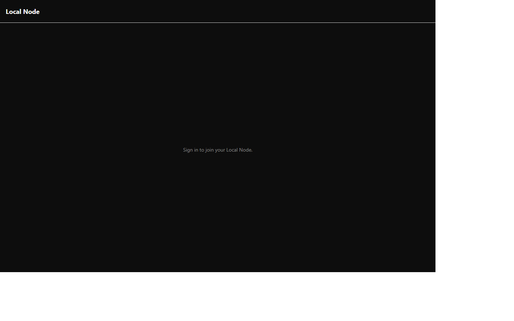

# Geo Discovery

Geo discovery uses H3 indexing to find nearby users while preserving privacy controls.

## Files

- `packages/geo-discovery/src/H3Grid.ts`
- `packages/geo-discovery/src/h3-grid.ts`
- `packages/geo-discovery/src/__tests__/h3-grid.test.ts`

## Behavior

- Converts user location to grid cells.
- Applies radius constraints for nearby results.
- Supports documentation-time mocked geolocation via `docs/dev-only/mock-geolocation.js`.

## Consent boundary

- Granting OS location permission only allows local H3 computation.
- Nearby presence publication is a separate default-off choice.
- Nearby identity reveal is explicit, encrypted, and per peer.
- Nearby presence and reveal do not create a public directory listing, durable
	relationship, Trust Circle membership, or directed-audience permission.
- Revocation stops publication and subscriptions and clears session reveal state.

## Visual evidence

- Video: ../docs/videos/local-and-geo-discovery.webm
