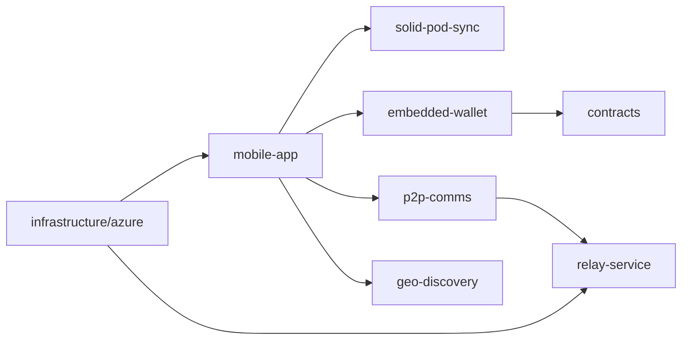
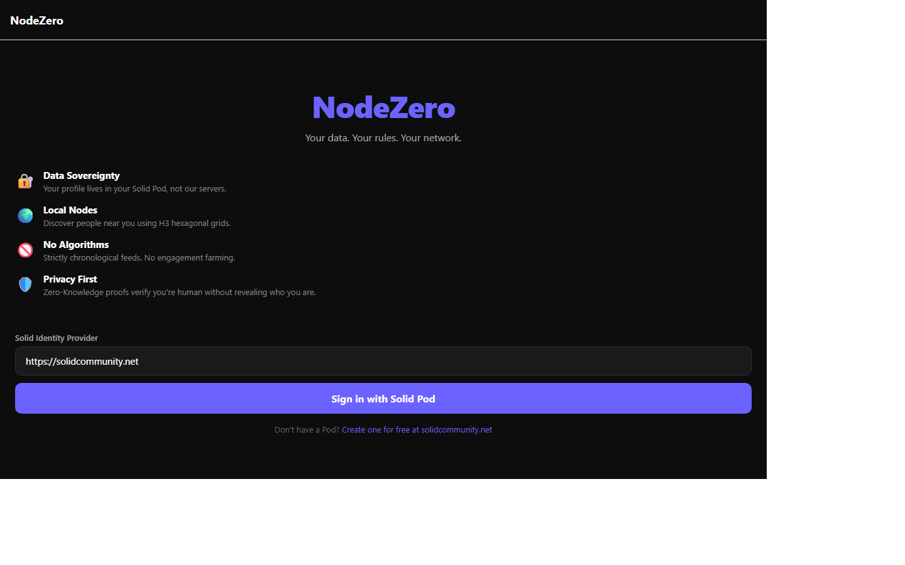
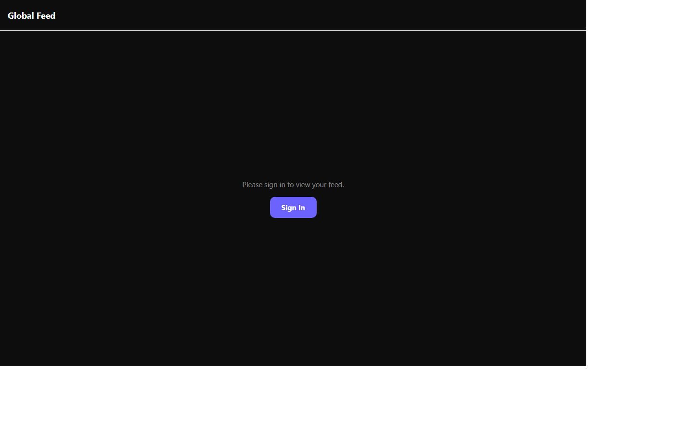

# NodeZero Social Wiki

NodeZero Social is a decentralized social platform built as a monorepo with mobile, relay, data sync, wallet, and infrastructure packages.

## Release snapshot (`v0.2.0-testnet`, 2026-07-30)

- The canonical installable Testnet PWA is live at `https://staging.nodezero.social`.
- TestNet lockbox factory v3 is `CDFHCQA3YJCITWEMNLCSRGQVVFEXGTONWSQJTD5VIZO7YV4IOKZUPCGT`.
- Browser wallets use encrypted, profile-scoped IndexedDB with a non-extractable key.
- Authentication is internal: one-tap Stellar signatures, host-only API cookie,
  memory-only web tokens, and exact client-side V3 lockb0x verification.
- Profile and DocuStream RSS data persist in the user's Pod and survive browser
  close/reopen plus returning sign-in.
- Community Directory is live as a dedicated tab between Feed and Backpack.
- Staging deploy run `30599014484` passed auth, recovery, V3, DocuStream, and
  mashlib gates; retained mobile-browser acceptance passed.

## Quick links

- [Architecture](Architecture)
- [Consentful Discovery](Consentful-Discovery)
- [Getting Started](Getting-Started)
- [Mobile App](Mobile-App)
- [Solid Pod Sync](Solid-Pod-Sync)
- [P2P Comms](P2P-Comms)
- [Relay Service](Relay-Service)
- [Embedded Wallet](Embedded-Wallet)
- [ZK Crypto](ZK-Crypto)
- [Smart Contracts](Smart-Contracts)
- [Azure Platform](Azure-Platform)
- [Geo Discovery](Geo-Discovery)
- [Contributing](Contributing)
- [Security](Security)
- [Roadmap](Roadmap)
- [FAQ](FAQ)

## Architecture at a glance

## Source references

- Monorepo overview: ../README.md
- Changelog: ../CHANGELOG.md
- Feature progress + upstream attribution: ../docs/feature-implementation-attribution.md
- Milestone H evidence summary: ../docs/archive/2026-milestone-h/milestone-h-release-evidence-summary.md
- Milestone I evidence summary: ../docs/archive/2026-milestone-i/milestone-i-release-evidence-summary.md
- Staging release requirements: ../docs/archive/2026-pre-staging/testnet-azure-release-requirements.md
- Release verification: ../docs/process/release-verification.md
- Current verified status: ../docs/executive-summary.md
- Runtime status and evidence: ../docs/staging-runtime-implementation-roadmap.md
- System purpose and trust posture: ../docs/system-description.md
- Milestone Q implementation plan: ../docs/consentful-pod-owner-discovery-and-communication-plan.md

## Walkthrough evidence

- Video: ../docs/videos/onboarding-and-feed.webm
