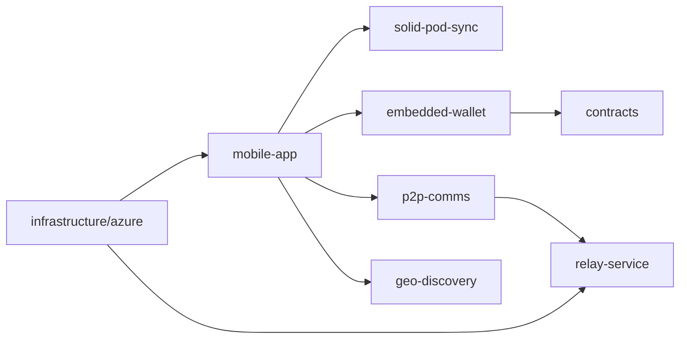

# NodeZero Social Wiki

NodeZero Social is a decentralized social platform built as a monorepo with mobile, relay, data sync, wallet, and infrastructure packages.

## Release snapshot (v0.0.2, 2026-07-05)

- Staging is live at `https://staging.nodezero.social` with a defined hardening backlog.
- TestNet lockbox factory is `CA5MASVC7CH646QUZM6HFC3JAYIG4TCRHJDSBDOBFP66IW7TXYYHFUVB`.
- Current lockbox factory wasm hash is `55bcb3a4c05ff935a421f10d1a72bdeb6e4573de8954e4fbd263f7ac88a8fbd9`.
- Docustream RSS source management (add/toggle/delete + ingest) is live in the app.

## Quick links

- [Architecture](Architecture)
- [Getting Started](Getting-Started)
- [Mobile App](Mobile-App)
- [Solid Pod Sync](Solid-Pod-Sync)
- [P2P Comms](P2P-Comms)
- [Relay Service](Relay-Service)
- [Embedded Wallet](Embedded-Wallet)
- [ZK Crypto](ZK-Crypto)
- [Smart Contracts](Smart-Contracts)
- [Azure Platform](Azure-Platform)
- [Geo Discovery](Geo-Discovery)
- [Contributing](Contributing)
- [Security](Security)
- [Roadmap](Roadmap)
- [FAQ](FAQ)

## Architecture at a glance

## Source references

- Monorepo overview: ../README.md
- Changelog: ../CHANGELOG.md
- Feature progress + upstream attribution: ../docs/feature-implementation-attribution.md
- Staging release requirements: ../docs/testnet-azure-release-requirements.md
- Staging UAT checklist: ../docs/staging-uat-checklist.md
- Runtime status and evidence: ../docs/staging-runtime-implementation-roadmap.md

## Walkthrough evidence

- Video: ../docs/videos/onboarding-and-feed.webm
