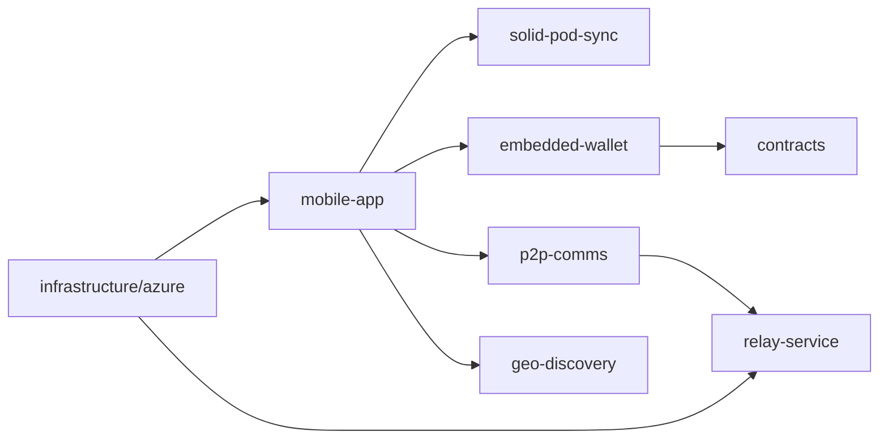

# NodeZero Social Wiki

NodeZero Social is a decentralized social platform built as a monorepo with mobile, relay, data sync, wallet, and infrastructure packages.

## Quick links

- [Architecture](Architecture)
- [Getting Started](Getting-Started)
- [Mobile App](Mobile-App)
- [Solid Pod Sync](Solid-Pod-Sync)
- [P2P Comms](P2P-Comms)
- [Relay Service](Relay-Service)
- [Embedded Wallet](Embedded-Wallet)
- [ZK Crypto](ZK-Crypto)
- [Smart Contracts](Smart-Contracts)
- [Azure Platform](Azure-Platform)
- [Geo Discovery](Geo-Discovery)
- [Contributing](Contributing)
- [Security](Security)
- [Roadmap](Roadmap)
- [FAQ](FAQ)

## Architecture at a glance

## Source references

- Monorepo overview: ../README.md
- Staging release requirements: ../docs/testnet-azure-release-requirements.md
- Staging UAT checklist: ../docs/staging-uat-checklist.md
