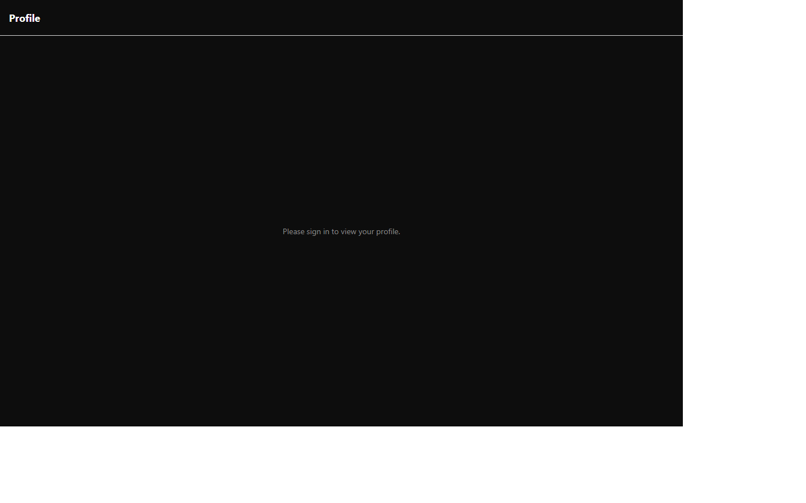
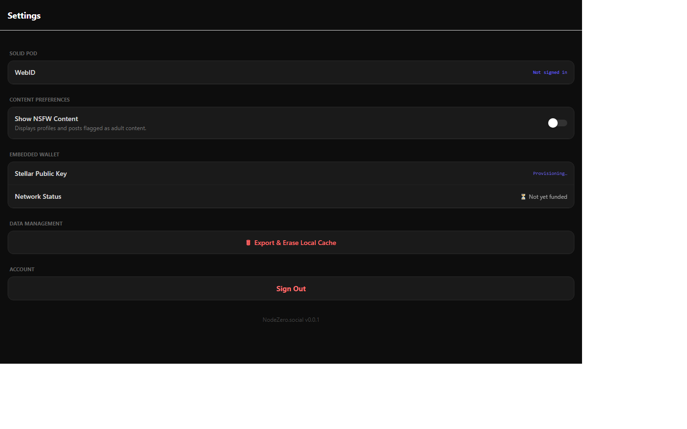

# Mobile App

The mobile app package hosts the main user experience via Expo Router.

## Primary routes

| Route | URL | Auth required | Unauthenticated behavior |
|---|---|---|---|
| Landing | `/` | No | Public sign-in and onboarding entry |
| Onboarding | `/onboarding` | Yes | Redirected from landing when pairing is not yet verified |
| Feed | `/feed` | Yes | "Please sign in to view your feed." |
| Local Node | `/local` | Yes | "Sign in to join your Local Node." |
| Broadcast | `/compose` | Yes | Requires active session |
| Stream | `/docustream` | Yes | Requires active session for Pod-backed source management and stream ingest |
| Backpack | `/backpack` | Yes | Requires active session for ACL updates |
| Profile | `/profile` | Yes | "Please sign in to view your profile." |
| Settings | `/settings` | No (partial) | Shows pod/wallet/prefs with signed-out state |

## Web navigation tabs

Authenticated web users see these tabs in the bottom navigation:
- Local
- Broadcast
- Stream
- Feed
- Backpack
- Profile

Settings is intentionally excluded from tabs and accessed from Profile via the gear icon.

## Landing page (`/`)

The landing page renders without authentication and includes:
- **Hero**: decentralized social onboarding and value proposition
- **Feature cards**: ownership, local discovery, no feed manipulation, privacy-first identity
- **Solid sign-in form**: identity-provider picker (Node Zero Community Server default) + "Sign In" action
- **Create Your Node form**: handle + notification email + password + confirm password (password min 12 chars, user-chosen — used for manual login fallback and returning sign-in)
- **Redirect logic**:
	1. Signed-in + verified pairing attestation goes to `/feed` (or `/local` for seamless node sessions).
	2. Signed-in + unverified attestation goes to `/onboarding`.

### New-user create flow (web)

1. Wallet + ZK proof are prepared on-device; provisioner creates Pod, WebID, and on-chain lockb0x anchor.
2. App hands off to the IdP login page with the one-time OIDC bridge ticket (`nz_oidc_bridge`, `nz_oidc_bridge_consume`) and a validated `nz_return` as top-level URL params.
3. Login template consumes the ticket and signs in via the CSS account API, then returns to the app with `nz_bridge_return=1`.
4. App automatically resumes the OIDC flow — IdP session exists, so it proceeds to consent and establishes the authenticated session.
5. Any bridge failure leaves the login form usable for manual credentials (the user knows their password).

### Auth validation behavior (current implementation)
- Empty IdP URL: "Enter your Identity Provider URL."
- Non-HTTPS IdP URL: "URL must start with https://"
- Valid HTTPS IdP: continues to Solid OIDC sign-in flow
- Login failure fallback: "Sign-in failed. Check the URL and try again."
- Password shorter than 12 chars: "Password must be at least 12 characters."
- Mismatched passwords: "Passwords do not match."

## UI navigation tabs and feature catalog

### Local tab

- **Purpose**: local proximity messaging using H3 geo cells and relay-assisted P2P signaling.
- **How it is used**: user grants location, joins local node, selects recipient WebID, sends message.
- **Data handling**:
	- reads device location and converts coordinates into H3 cell state for UI and discovery context.
	- uses signaling relay plus peer channels for message exchange.
	- reads known peers from social graph connections.
	- raw GPS coordinates are not displayed or transmitted by this flow; H3 cell identity is used.

### Broadcast tab

- **Purpose**: compose and target broadcasts by trust boundary.
- **How it is used**: user writes a post and selects one audience ring.
- **Data handling**:
	- FOAF audience reads social connections and writes JSON payloads to Pod outbox path via authenticated fetch.
	- Verified audience applies an additional verification gate before writes for recipient targets.
	- Local audience path initializes local channel targeting and currently does not persist post content to Pod from this screen.

### Stream tab

- **Purpose**: aggregated downstream stream with filtering and save action.
- **How it is used**: user filters by source and saves selected items to Pod.
- **Data handling**:
	- supports RSS source registry actions (add source, enable/disable, delete source).
	- source configuration is persisted to the user's Pod and loaded on session resume.
	- enabled RSS sources are ingested into the stream pipeline.
	- loads Pod-backed stream entries when available, with mock fallback content.
	- save action appends item payload as JSON-LD into public docustream container in the user Pod.

### Feed tab

- **Purpose**: chronological timeline from followed users.
- **How it is used**: user opens feed and refreshes.
- **Data handling**:
	- reads social graph connections.
	- reads each connection profile and docustream activities.
	- maps items into feed cards and sorts newest-first by timestamp.
	- this screen aggregates reads and does not directly write feed content.

### Backpack tab

- **Purpose**: user-facing permission toggles for data containers.
- **How it is used**: user toggles Public Profile, Interest Graph, and Exact Location cards.
- **Data handling**:
	- updates UI state optimistically and reverts on ACL failure.
	- calls ACL update helper to write policy changes for relevant container targets.

### Profile tab

- **Purpose**: edit and persist user profile metadata.
- **How it is used**: user edits display name, bio, avatar URL, external URL, and interests, then saves.
- **Data handling**:
	- reads profile from Pod into local form state.
	- writes profile back to Pod and re-reads after save.
	- interest tags are normalized from comma-separated input.
	- NSFW modal and banners depend on Pod-backed profile NSFW flag.
	- peer view can compute shared semantic interest overlap.

## Settings page (`/settings`)

Settings is partially accessible without authentication:

| Section | Content | Auth state |
|---|---|---|
| Solid Pod | WebID | "Not signed in" when unauthenticated |
| Content Preferences | NSFW content toggle | Always visible |
| Embedded Wallet | Stellar public key + network status | Provisioning on load |
| Data Management | "Export & Erase Local Cache" button | Always visible |
| Account | "Sign Out" button | Always visible |
| Version | "NodeZero.social v0.0.2" | Always visible |

## Notes on data ownership model

- **Pod-first application model**:
	- profile, social graph, and stream content are read and written in the user-owned Solid Pod.
- **Local application storage**:
	- UX preferences and attestation/session artifacts are kept in local app storage mechanisms.
- **Chain-linked identity context**:
	- wallet and attestation flows bind Solid identity and Stellar-linked state while preserving environment-coherence constraints.

## Contexts

- `WalletContext`: wallet lifecycle and registration.
- `SolidContext`: SOLID identity/session handling.
- `DiscoveryContext`: location/discovery state.

## Confirmed functionality

- Landing page renders hero and Solid sign-in flow.
- Route guards protect authenticated surfaces including feed, local, profile, and tab-only experiences.
- Feed screen now aggregates connections from Solid social graph and orders posts chronologically.
- Local Node screen uses relay-backed P2P signaling and supports target selection from known peers.
- Docustream screen supports RSS source add/toggle/delete and ingest into stream results.
- Settings renders wallet state, NSFW toggle, and account controls for signed-in and signed-out users.

## Known gaps and resolution status

| ID | Issue | Status | Fix |
|---|---|---|---|
| WR1 | Wallet provisioning silently fails on web — `expo-secure-store` calls `getValueWithKeyAsync` (native-only bridge method); Settings shows "Provisioning…" forever | **FIXED** in testnet commit 778c37f | `Platform.OS === 'web'` guard in `WalletContext.tsx` skips `SecureStore` on web, using in-memory fallback |
| J4 | Authenticated journeys (LM1/LM2/WR2/AU4) not fully re-run on latest branch set | **Pending QA rerun** | Execute authenticated staging checklist after B1/B2 integration deploy |

## Notes

- Staging profile and chain settings are guarded for environment coherence.
- SWA deployment support is wired for the web build path.

## Visual evidence

- Video: ../docs/videos/profile-and-settings.webm

## Primary route files

- `packages/mobile-app/app/index.tsx`
- `packages/mobile-app/app/onboarding.tsx`
- `packages/mobile-app/app/feed.tsx`
- `packages/mobile-app/app/local.tsx`
- `packages/mobile-app/app/compose.tsx`
- `packages/mobile-app/app/docustream.tsx`
- `packages/mobile-app/app/backpack.tsx`
- `packages/mobile-app/app/profile.tsx`
- `packages/mobile-app/app/settings.tsx`
- `packages/mobile-app/app/_layout.tsx`
